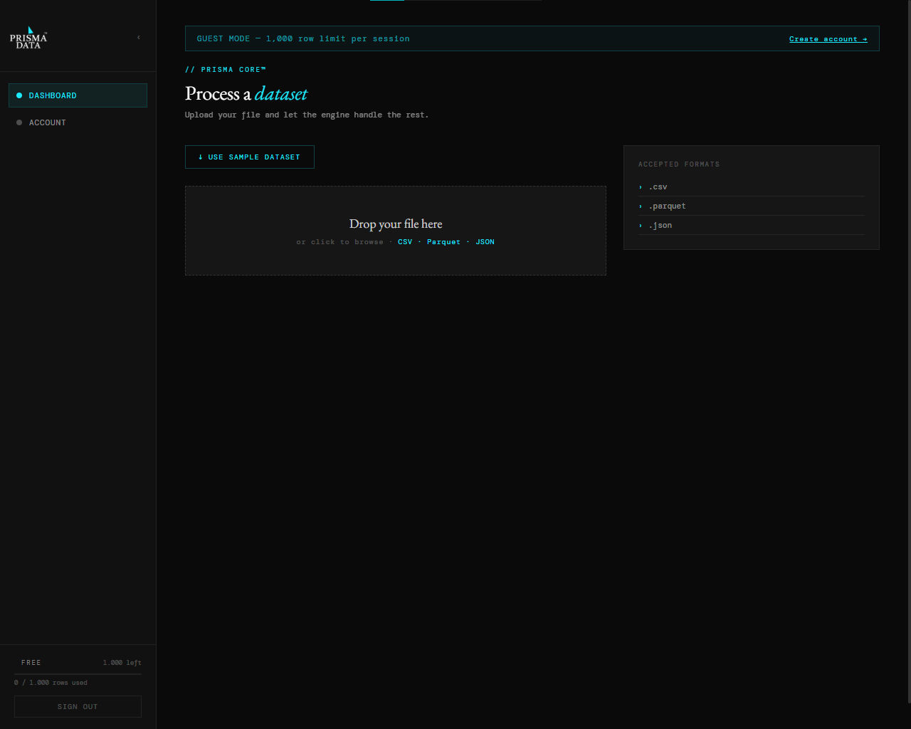
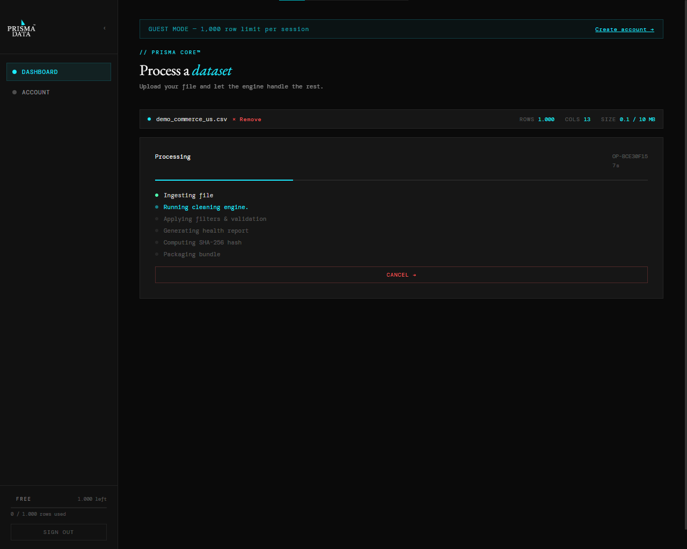
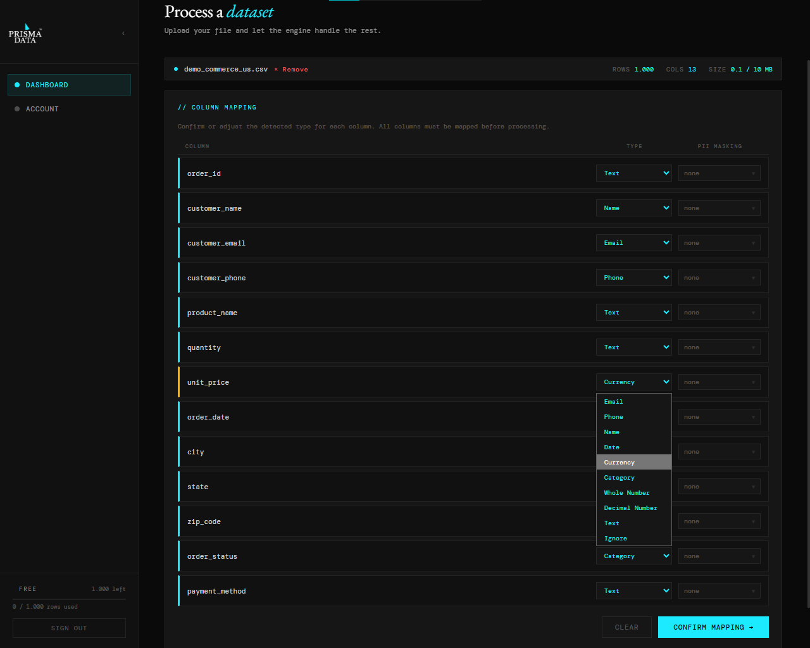
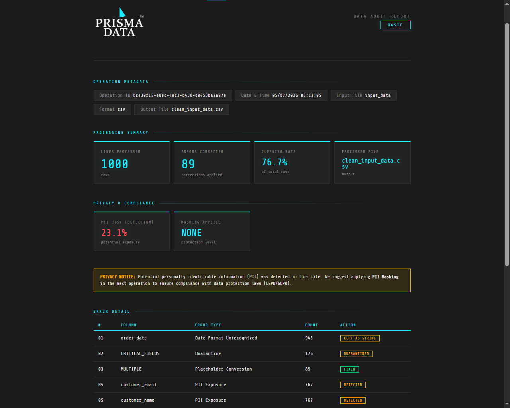

# Prisma Data™

Prisma Data is a data governance platform designed to improve data quality, standardization, auditing, and compliance across datasets of any size. At its core is Prisma Core, the processing engine responsible for the entire data pipeline.

## Project Status

**Live Demo:** [Try Prisma Data](https://prisma-data-core.vercel.app/)

**Portfolio:** [More Projects](https://jef-dev-portfolio.vercel.app)

Prisma Data is no longer under active development. The source code for Prisma Data is private.

This public repository exists to document the project's architecture, showcase its interface, and provide a technical overview for portfolio and evaluation purposes.

---

## Objective

Prisma Data originated as a tool for automating the standardization of XLS and XLSX files through a user-friendly interface. Its initial objective was to simplify repetitive data preparation tasks without requiring scripting or technical expertise. As the project evolved, it gradually expanded into a broader data governance platform.

---

## Architecture

The final version of Prisma Data no longer supports XLS and XLSX files. Support was removed after spreadsheet parsing became a performance bottleneck in the processing pipeline.

The application is organized into five main processing stages:

- ETL
- Standardization
- Data Quality
- Compliance
- Auditing

### Input

Users can upload datasets through a drag-and-drop interface.

Supported formats:

- CSV
- JSON
- Parquet

### Core

Regardless of the input dataset size, Prisma Core converts every supported dataset into the Parquet format. This intermediate representation improves processing performance and provides a consistent structure throughout the pipeline.

### Output

Depending on the processing workflow, Prisma Core can generate:

- Clean datasets
- Quarantined datasets
- SHA-256 integrity hashes
- HTML health reports
- SQLite databases
- Parquet files
- JSON files

## Technical Decisions

### Why Parquet?

Parquet was adopted as Prisma Core's internal format due to its columnar structure and high processing performance. By converting every supported input into a single optimized representation, the remaining stages of the pipeline can operate consistently regardless of the original file format.

### Why Polars?

The project was initially developed using Pandas. As dataset sizes increased and new processing stages were introduced, performance became a limiting factor. Migrating to Polars significantly reduced processing time and memory consumption while providing seamless integration with the Parquet format adopted by Prisma Core.

## Stack

### Core

- Python
- Polars
- Parquet

### Backend

- FastAPI
- PostgreSQL

### Frontend

- JavaScript

## Gallery

Below are screenshots illustrating different stages of the application workflow.

### Dashboard

### Processing Pipeline

### Column Mapping

### Health Report

## Key Features

- Multi-format data ingestion (CSV, JSON, Parquet)
- Automated ETL pipeline
- Data standardization
- Data quality validation
- Compliance checks
- SHA-256 integrity verification
- HTML health reports
- SQLite export

## Lessons Learned

Developing Prisma Data provided practical experience in:

- Designing data processing pipelines
- Performance optimization
- Working with columnar data formats
- Backend architecture
- Trade-offs between usability and performance
- Documentation and software maintainability
- Frontend interface design

## Contact

- **Portfolio:** [Portfolio](https://jef-dev-portfolio.vercel.app)
- **GitHub:** [GitHub](https://github.com/Jeferson-prz)
- **LinkedIn:** [Linkedin](https://www.linkedin.com/in/jeferson-lopes-b4a2a9416)
- **Email:** jeferson.contact.freela@gmail.com

## License

This repository is provided for portfolio, evaluation, and demonstration purposes only.

All Rights Reserved.
=======
# prisma-data
Public showcase of Prisma Data, a data governance platform built around ETL, data quality, compliance, and auditing.
